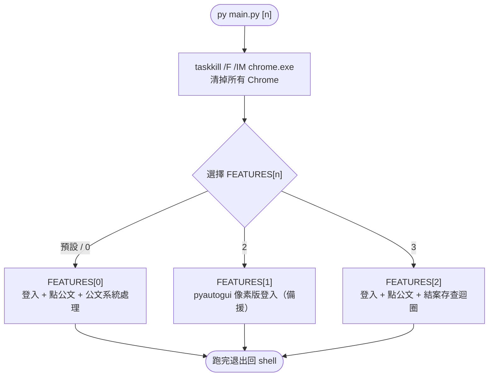
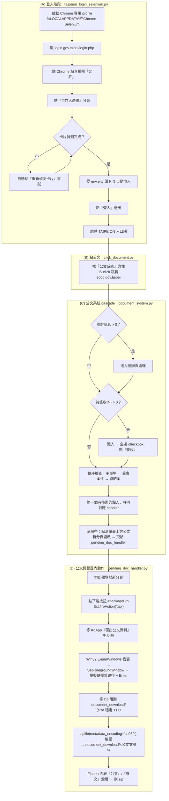
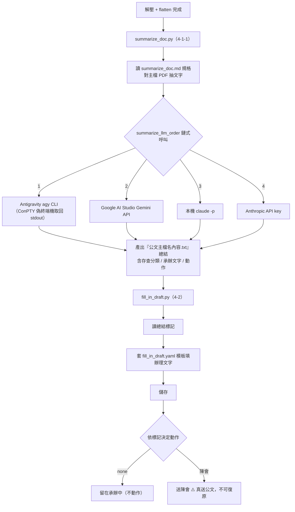
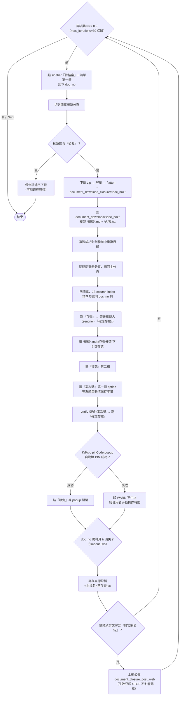
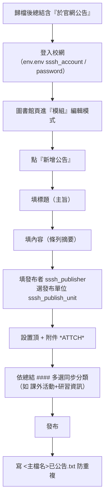
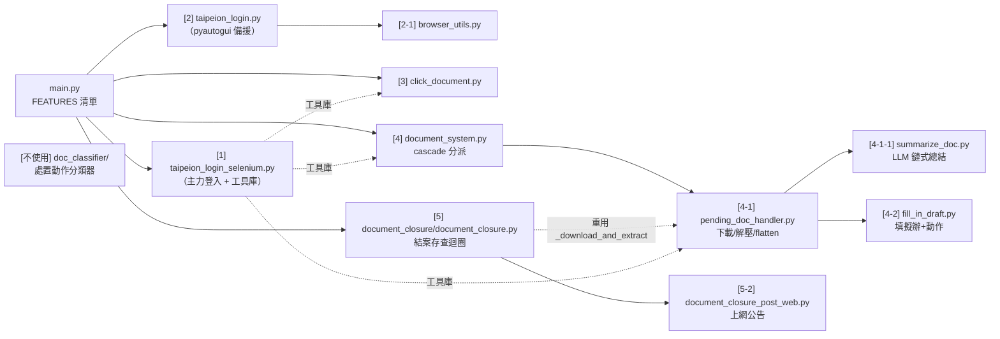

# sssh-automation 流程圖

臺北市公文系統自動化 — 依 [README.md](README.md) 整理的 Mermaid 流程圖。

<!-- 本檔由 README.md 內容生成；改流程請同步更新 README 與此檔 -->

---

## 1. 整體入口與功能分派（main.py）

---

## 2. FEATURES[0] — 登入 + 點公文 + 公文系統處理（主力流程）

---

## 3. 承辦中公文後處理（summarize → fill_in_draft）

---

## 4. FEATURES[2] — 結案存查迴圈（document_closure.py）

(A)~(C) 同 FEATURES[0]，processor 換成 `process_document_closure`。

---

## 5. 上網公告（document_closure_post_web.py，5-2）

---

## 6. 模組依賴關係

> **輸出結束 LDC**
